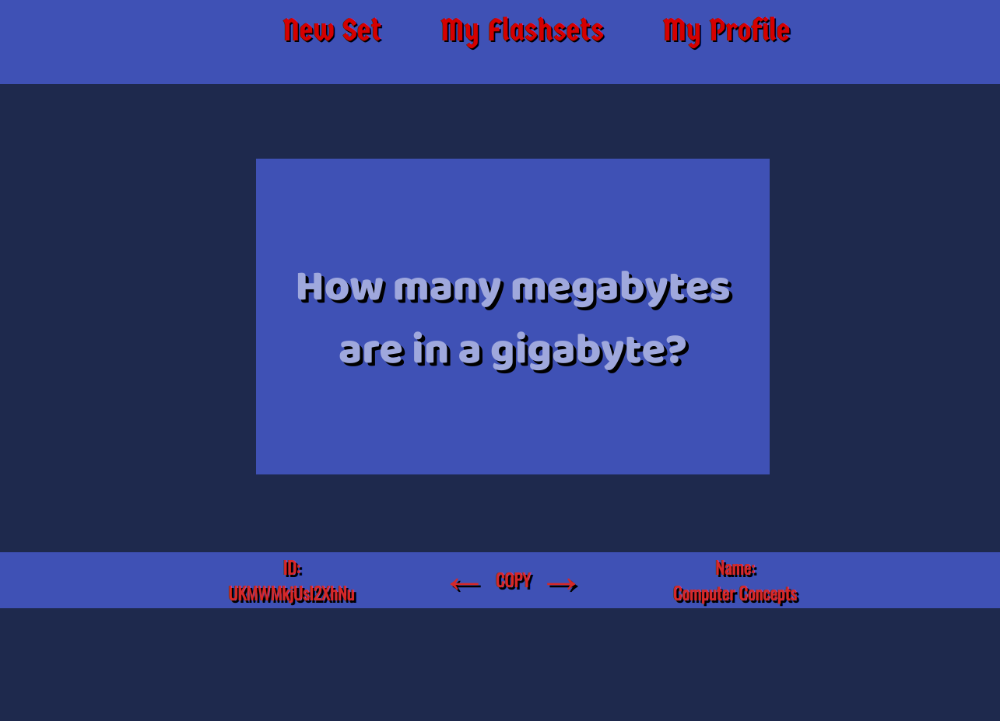
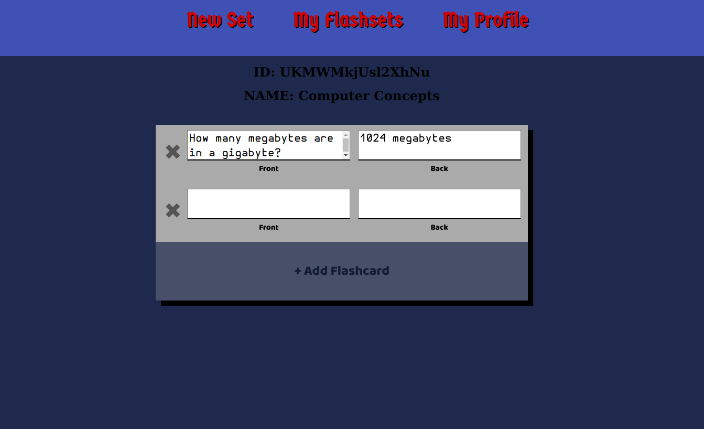

# Flash Cards Spring

Flash card website in Spring MVC/Boot. Allows users to create and share flashcard sets.

## About

My final project for 2nd semester of AP Computer Science class.

Built in Spring Boot and Spring MVC. JDBC for querying of database, Postgresql database, authentication and security using Spring Security, jquery for post/ get requests and element manipulation.

&nbsp;&nbsp;&nbsp;&nbsp;

### Creating Database

Define environment variables `$DB_NAME`, `$DB_USERNAME`, and `$DB_SCHEMA_FILE` then run `init_db.sh` to initilize database and tables.
OR you can pass name of database, username of database owner as arguments (LESS OPTIMAL) i.e.

    ./init_db.sh "dbflashcards" "cooluser123" "schema.sql"

### Before Building with Maven

`application.properties` uses environment variables `$DB_NAME`, `$DB_USERNAME`, and `$DB_PASSWORD` so you must set those variables before building with maven
or of course you can just edit the `application.properties` as well (LESS OPTIMAL).

### URLs

/flashcards/ is the SUB-URL of project, obviously can be adjusted.

## Other stuff

Need to fix images and icons, got removed when I took down my web server.
